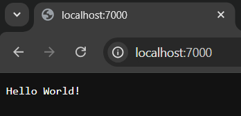
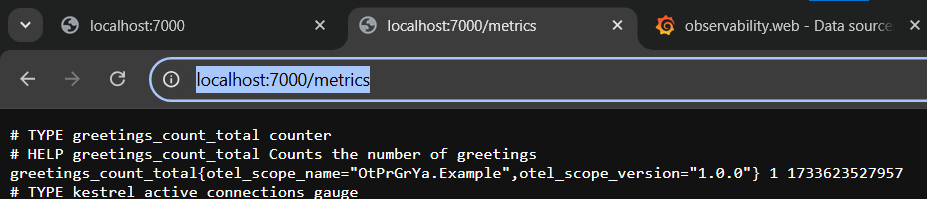
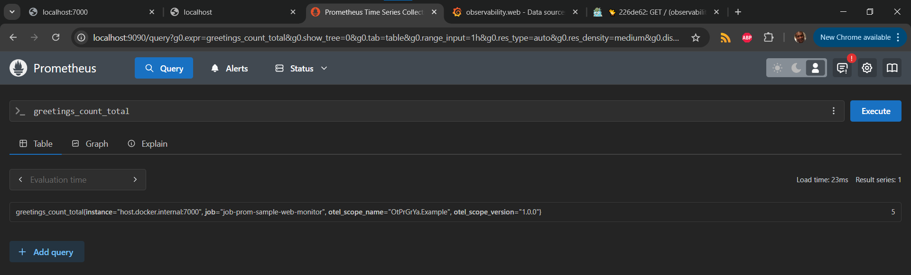
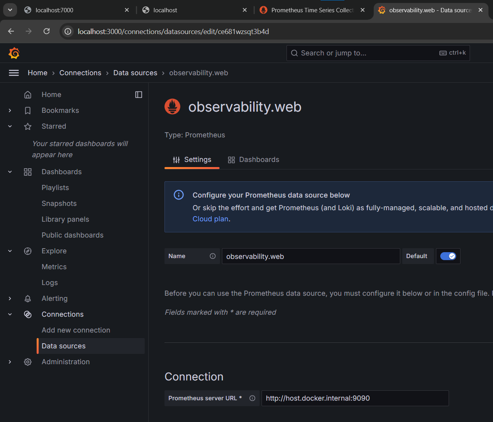
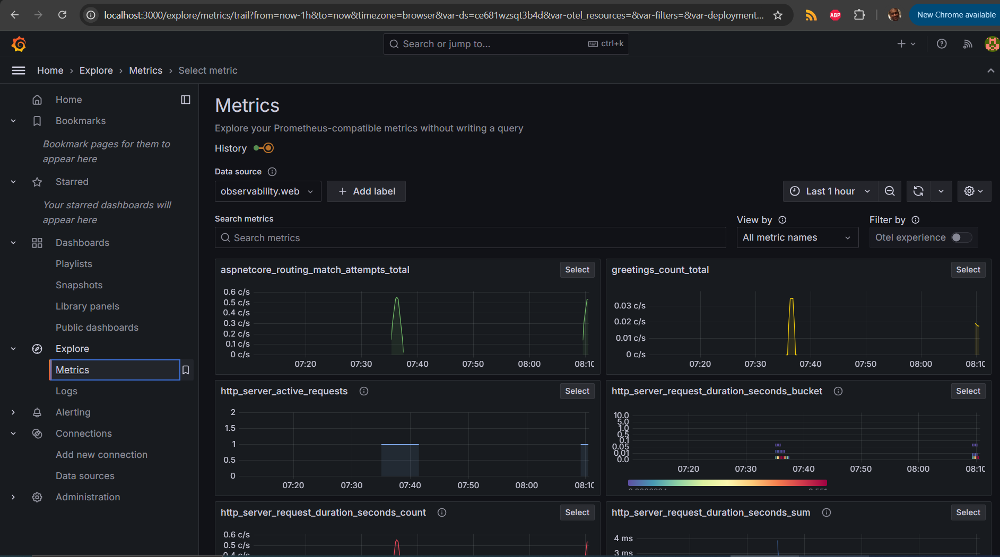
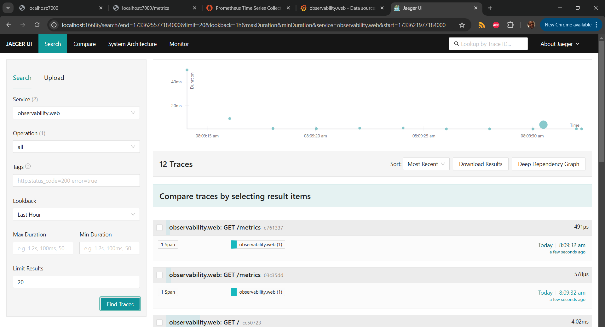

# dotnet-observability
- Simple Docker solution to demonstrate Observability in .NET using OpenTelemetry, Prometheus, Grafana and Jaeger
- This is based on the article [Example: Use OpenTelemetry with Prometheus, Grafana, and Jaeger](https://learn.microsoft.com/en-us/dotnet/core/diagnostics/observability-prgrja-example#9-distributed-tracing-with-jaeger)

# Usage
- docker-compose up
- Observability.web at http://localhost:7000

- Observability.web metrics at : http://localhost:7000/metrics

- Prometheus collector at: http://localhost:9090/

- Grafana at http://localhost:3000/
	- Register
   	
   	
	- Create a connection to Prometheus with url as http://host.docker.internal:9090

    	
- Jaeger at http://localhost:16686/

# Backlog
